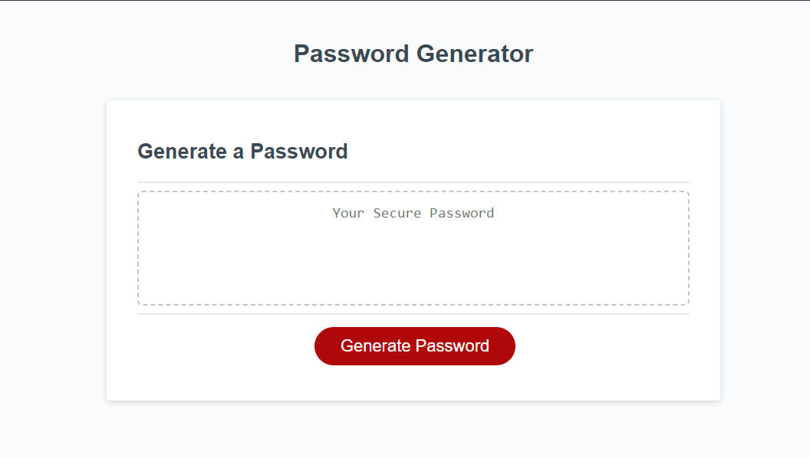
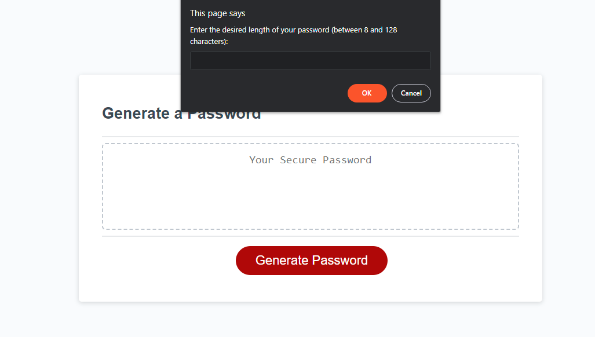
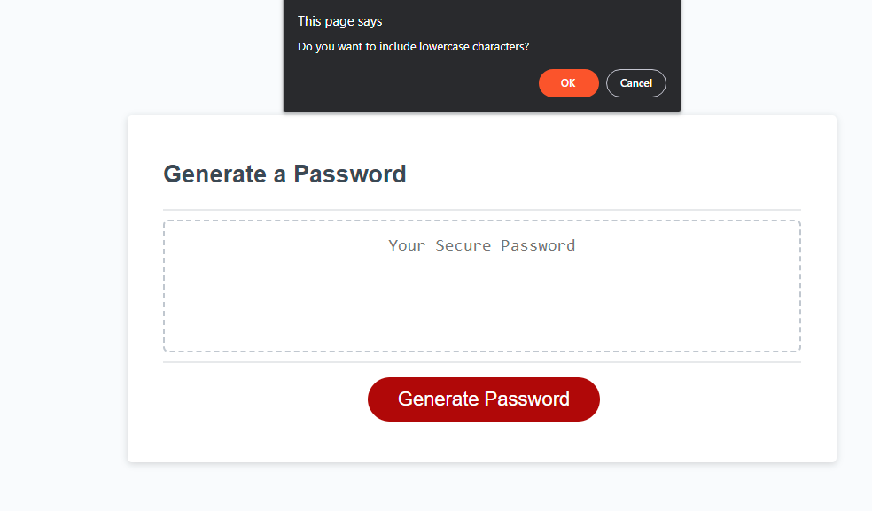
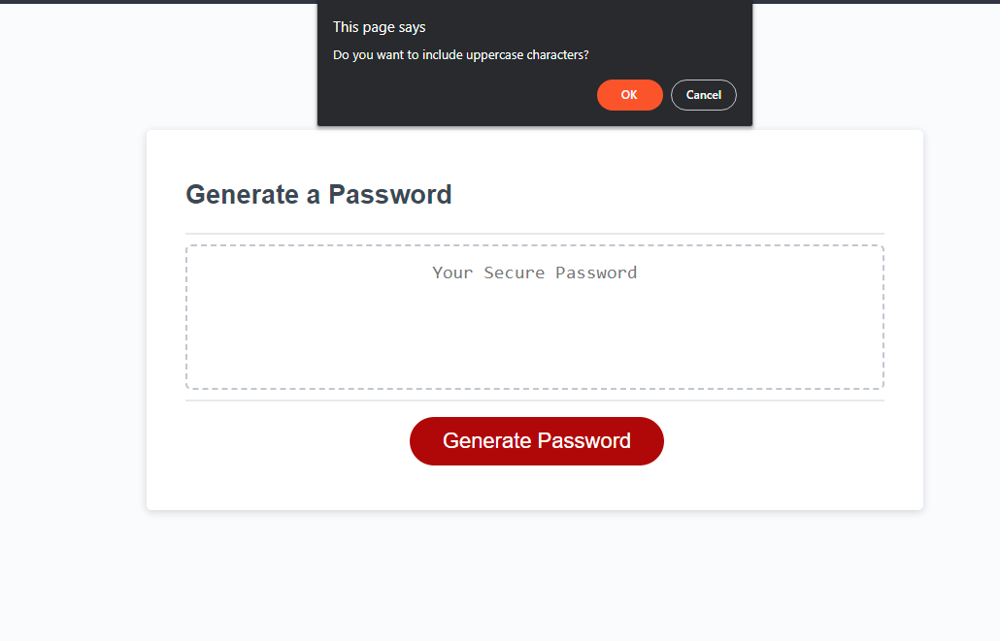
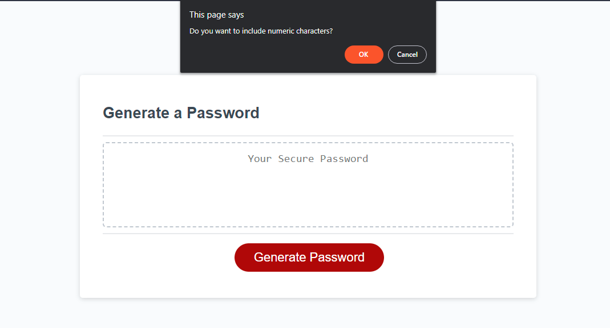
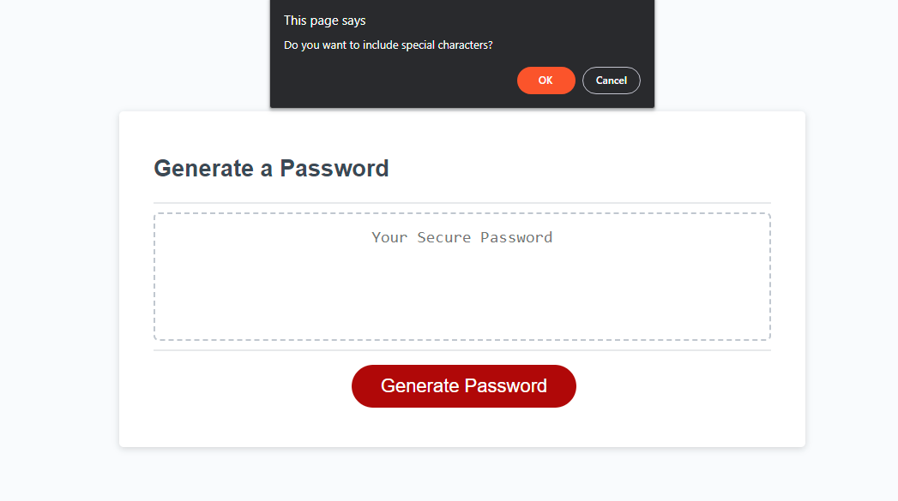
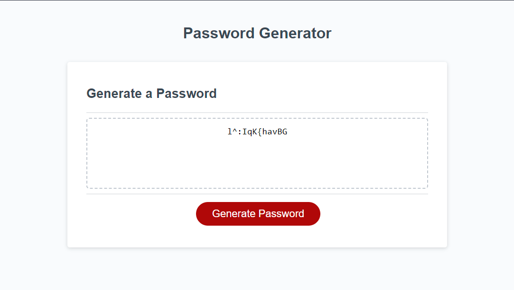
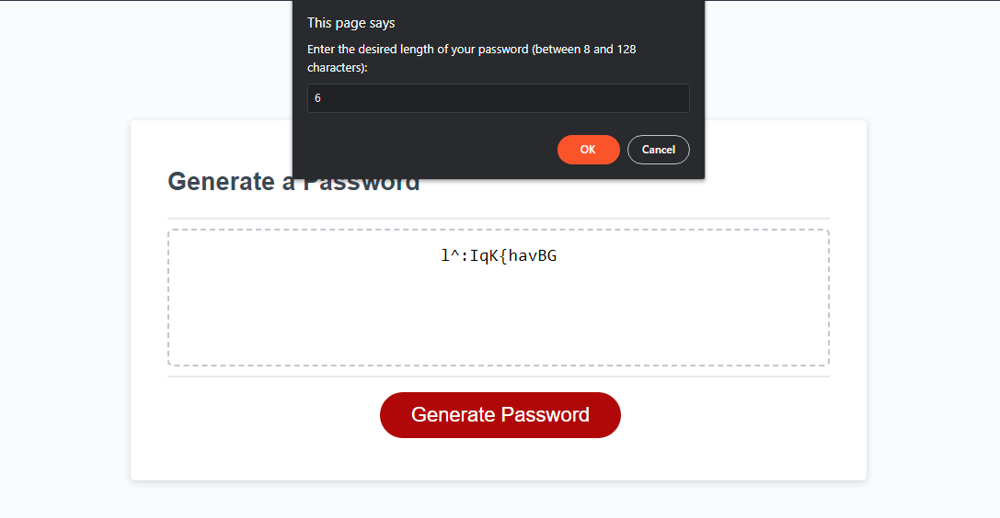
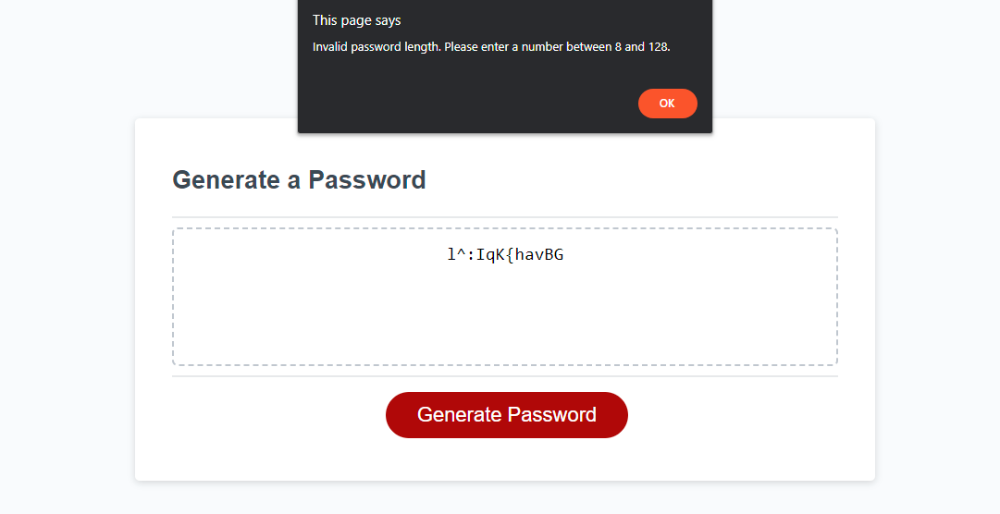
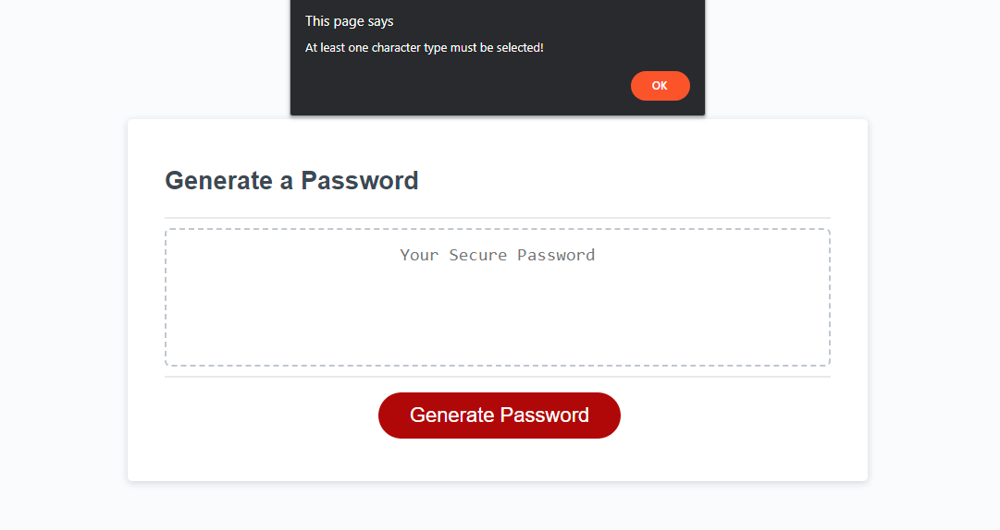

# Module-5-Challenge-Password-Generator

# Password Generator

## Description

I was tasked with creating a Password Generator which when the button is clicked presents a series of Prompts for the user to determine password criteria. These criteria include: Length (at least 8 chars), character types - lowercase, uppercase, numeric or special as well as validation for each type of input and ensuring at least one is chosen.

I was provided with 4 arrays to represent the different character types, as well as the basic framework for the structure of the code.

Once the user has advised the length and which character types to include, the password needs to be generated and displayed onto the page using the included document queryselector code.

## Installation
Please visit this URL to see how the website looks now: https://halcyonlegion.github.io/Module-5-Challenge-Password-Generator/

## Usage

The Challenge is comprised of 3 files. I revised the structure to bring it inline with what I have learned, I included the Images, CSS and JS in the assets folder. The HTML provides an interface for the user to see the result of the application the JavaScript drives this entire operation.

Upon first loading the generator it will appear like this this. To start things off click the "Generate Password" button:

When you do so it will prompt you for the aforementioned options: Length, Lowercase Characters, Uppercase Characters, Numeric characters and Special characters:

Once you have selected your options then the JavaScript will do its thing and produce a password to your specification:

There is validation at each step, for example if you choose an invalid length:

And if you fail to choose any of the Character Types:

## Credits

Roger Le the Instructor for this Bootcamp who has provided a lot of instruction and guidance on the journey so far. JavaScript continues to be my biggest hurdle as I found this extremely difficult, the fact I had done something very loosely similar to this in the past helped a lot but if I was looking at this for the first time I'd be completely lost. Thankfully this course has taught me how to use every single tool at my disposal to complete a challenge.

The University of Birmingham provided the materials and guides I used to get this started: https://www.birmingham.ac.uk/index.aspx

To the incredible people who contribute to Stack Overflow: https://stackoverflow.com/

The creators of the MDN: https://developer.mozilla.org/en-US/

W3 Schools: https://www.w3schools.com/

License
There is no license specified for this project.